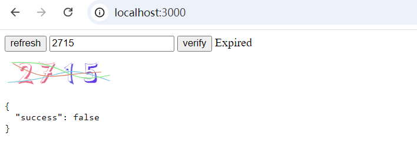

# nest-captcha

CAPTCHA module implemented using cache-manager, uuid, and svg-captcha（用 cache-manager、uuid 和 svg-captcha 实现的图形验证码模块）

See👀: [./src/captcha/captcha.module.ts](./src/captcha/captcha.module.ts)

